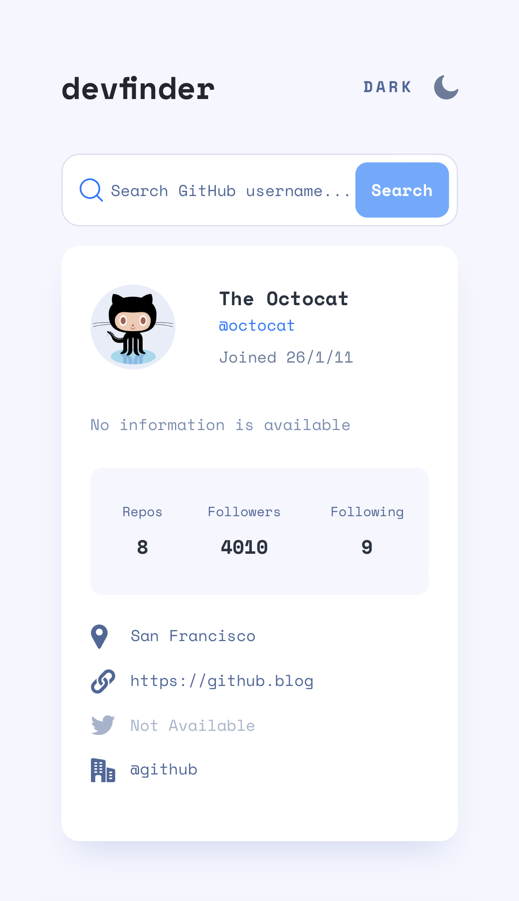

# GitHub user search app solution

This is a solution to the [GitHub user search app challenge on Frontend Mentor](https://www.frontendmentor.io/challenges/github-user-search-app-Q09YOgaH6).

## Table of contents

- [Overview](#overview)
  - [The app](#the-app)
  - [Screenshots](#screenshots)
  - [Links](#links)
- [My process](#my-process)
  - [Built with](#built-with)
  - [What I learned](#what-i-learned)
  - [Useful resources](#useful-resources)
- [Author](#author)

## Overview

### The app

Users should be able to:

- View the optimal layout for the app depending on their device's screen size
- See hover states for all interactive elements on the page
- Search for GitHub users by their username
- See relevant user information based on their search
- Switch between light and dark themes
- Have the correct color scheme chosen for them based on their computer preferences.

### Screenshots




### Links

- Repository: [GitHub](https://github.com/dmitrymitenkoff/github-user-search-app)
- Live: [devfinder app](https://github-user-search-app-flame.vercel.app/)

## My process

### Built with

- Semantic HTML5 markup
- CSS custom properties
- Flexbox
- CSS Grid
- Mobile-first workflow
- Third-party APIs
- Sass
- Parcel web app bundler

### What I learned

1. Switching between light and dark modes.
   I learned how to set dark and light themese automatically as per the user's OS settings. I also implemented the ability for users to toggle between the themes and save to local storage a preferred theme. The process wasn't straightforward and involved a number of steps both in CSS and JavaScript.

i. I created a theme-style Sass partial into which I saved all the root variables (using CSS Custom Properties). The root styles apply to the html element directly. I also set the "--color-mode" variable to "light" as a default theme. This value is then used in the JS theme switcher file: it tells the JavaScript what the user's theme preference is:

```css
:root {
  --color-mode: 'light';
  --color-light-primary: #ffffff;
  --color-light-secondary: #f5f7ff;
  --background-body: var(--color-light-secondary);
  --background-input: var(--color-light-primary);
  --background-card: var(--color-light-primary);
  --background-table: var(--color-light-secondary);
```

ii. I then set basic color styles for the light theme and created a media query that deals with user's OS preferences - "prefers-color-scheme". Under the media query, I also added a "data-user-color-scheme" and set it to "dark". In the media query, I changed the root color mode to dark, like so:

```css
body {
  background-color: var(--background-body);
  color: var(--color-dark-primary);
  transition: background 500ms ease-in-out, color 200ms ease;
}
@media (prefers-color-scheme: dark) {
  :root {
    --color-mode: 'dark';
  }
  :root:not([data-user-color-scheme]) {
    --background-body: var(--color-dark-body);
    --background-input: var(--color-dark-input);
    --background-card: var(--color-dark-input);
    --background-table: var(--color-dark-body);
  }
}
[data-user-color-scheme='dark'] {
  --background-body: var(--color-dark-body);
  --background-input: var(--color-dark-input);
  --background-card: var(--color-dark-input);
  --background-table: var(--color-dark-body);
}
```

iii. In the JavaScript file I created variables to store user's preferences and settings saved in the local storage as well as targeted a number of DOM elements to let the user manually change themes. I then created a function that allowed me to extract the user's "--color-mode" value. The function returns either "light" or "dark":

```js
function getCSSCustomProp(propKey) {
  let response = getComputedStyle(document.documentElement).getPropertyValue(
    propKey
  );
  if (response.length) {
    response = response.replace(/\"/g, '').trim();
  }
  return response;
}
```

iv. After that, I created a function that either applies the user's theme preference stored in localStorage or the value from the CSS color mode setting:

```js
function applySetting(passedSetting) {
  let currentSetting = passedSetting || localStorage.getItem(STORAGE_KEY);
  if (currentSetting) {
    document.documentElement.setAttribute(
      'data-user-color-scheme',
      currentSetting
    );
    setTextAndIcon(currentSetting);
  } else {
    setTextAndIcon(getCSSCustomProp(COLOR_MODE_KEY));
  }
}eturn response;
}
```

v. As the next step, I created a function to updated the toggle text and icon as per the user's theme choice. It sets the toggle text depending on what teh current theme is, which is always either "dark" or "light" (dark theme = light text)

```js
function setTextAndIcon(currentSetting) {
  if (currentSetting === 'dark') {
    modeToggleText.innerText = 'light';
    moon.classList.add('hidden');
    sun.classList.remove('hidden');
  } else {
    modeToggleText.innerText = 'dark';
    moon.classList.remove('hidden');
    sun.classList.add('hidden');
  }
}
```

vi. Next, I added a function to toggle themes. At first it attemps to use the current setting as set in the local storage. It then runs the value through a switch: if the theme mode is found, the function overrides it. If the mode value is not stored in the local storage, the function loads the mode value from CSS instead and overrides it:

```js
function toggleSetting() {
  let currentSetting = localStorage.getItem(STORAGE_KEY);
  switch (currentSetting) {
    case null:
      currentSetting =
        getCSSCustomProp(COLOR_MODE_KEY) === 'dark' ? 'light' : 'dark';
      break;
    case 'light':
      currentSetting = 'dark';
      break;
    case 'dark':
      currentSetting = 'light';
      break;
  }
  localStorage.setItem(STORAGE_KEY, currentSetting);
  return currentSetting;
}
```

vii. Finally, I added an event listener on the toggle to apply the current setting which is returned into the applySetting() function.

### Useful resources

- [Create a user controlled dark or light mode](https://piccalil.li/tutorial/create-a-user-controlled-dark-or-light-mode/)
- [A Complete Guide to Dark Mode on the Web](https://css-tricks.com/a-complete-guide-to-dark-mode-on-the-web/)
- [prefers-color-scheme](https://developer.mozilla.org/en-US/docs/Web/CSS/@media/prefers-color-scheme)
- [Event focus/blur](https://javascript.info/focus-blur)
- [Media Queries for Standard Devices](https://css-tricks.com/snippets/css/media-queries-for-standard-devices/)
- [CSS Animation Link Underline](https://paulund.co.uk/css-animation-link-underline)
- [Content Jumping (and How To Avoid It)](https://css-tricks.com/content-jumping-avoid/)
- [Change Color of SVG on Hover](https://css-tricks.com/change-color-of-svg-on-hover/)
- [CSS Button Styling Guide](https://moderncss.dev/css-button-styling-guide/)
- [3 CSS Grid Techniques to Make You a Grid Convert](https://moderncss.dev/3-css-grid-techniques-to-make-you-a-grid-convert/)

## Author

- Twitter - [@walzinthedesert](https://www.twitter.com/walzinthedesert)
